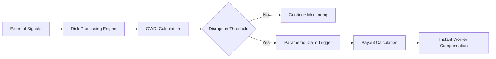
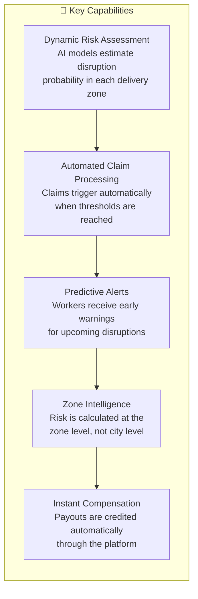
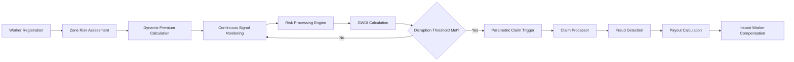

# Safra — AI-Powered Parametric Insurance for Gig Delivery Workers

Safra is an **AI-driven parametric micro-insurance platform** designed to protect the income of **quick-commerce delivery partners** working for platforms such as **Zepto, Blinkit, and Instamart**.

Gig delivery workers depend on continuous order flow to earn their daily income. However, external disruptions such as **extreme weather, severe air pollution, platform outages, or sudden delivery activity collapse** can instantly stop deliveries, causing riders to lose several hours of income.

Traditional insurance products are not designed to address **short-term income interruptions**, leaving gig workers financially vulnerable during these disruptions.

Safra solves this problem by introducing **automated parametric income protection**. Instead of requiring workers to file claims manually, the platform continuously monitors external signals such as **weather conditions, air quality levels, and delivery activity patterns**. When predefined disruption conditions are detected, Safra automatically triggers compensation.

The system combines **AI-driven risk assessment, dynamic premium pricing, automated disruption detection, and fraud monitoring** to create a scalable safety net for gig economy workers operating in unpredictable urban environments.

Safra does not just act as an insurance platform. By integrating **predictive disruption alerts, intelligent risk mapping, and worker assistance features**, the system helps riders make better decisions about **when and where to work**, enabling them to protect and stabilize their income.

## Project Overview

**Safra** is an AI-powered parametric insurance platform designed to protect the income of quick-commerce delivery partners working for platforms such as **Zepto, Blinkit, and Instamart**.

Delivery riders in the gig economy rely on completing a high number of short-distance deliveries throughout the day to earn their income. However, external disruptions such as **heavy rainfall, extreme heat, severe air pollution, delivery activity collapse, and platform downtime** can suddenly halt delivery operations. When this happens, riders lose valuable working hours and experience immediate income loss.

Safra addresses this problem by providing **automated weekly micro-insurance for income protection**. Workers enroll in the platform and receive dynamically priced coverage based on the **risk profile of their delivery zone** rather than broad city-level averages.

The platform continuously analyzes environmental and operational signals using a composite **Gig Worker Disruption Index (GWDI)**, which aggregates multiple real-time risk factors including:

- weather risk  
- air pollution levels  
- traffic and operational conditions  
- delivery activity trends  

By combining these signals, Safra calculates the probability of disruption events affecting delivery operations in a specific zone.

When predefined disruption conditions are detected—such as **heavy rainfall, extreme heat, severe pollution, delivery activity collapse, or platform downtime**—the system automatically triggers a parametric claim. Compensation is calculated based on the **duration of the disruption** and is credited to the worker without requiring manual claim submissions.

In addition to automated compensation, Safra also introduces **predictive disruption intelligence**. The system can forecast potential disruption risks before they occur and send alerts to workers, allowing them to:

- plan work schedules  
- switch to nearby zones with higher demand  
- temporarily pause work during unsafe conditions  

By combining **AI-driven risk modeling, dynamic pricing, predictive alerts, and automated payouts**, Safra creates a scalable financial protection system specifically designed for the operational realities of the gig economy.
## Target Persona

Safra is designed for **quick-commerce delivery partners working on platforms such as Zepto, Blinkit, and Instamart**. These riders operate in dense urban areas and complete multiple short-distance deliveries throughout the day.

A typical delivery partner works between **8–10 hours daily**, completing **2–4 deliveries per hour** within a small service radius of approximately **2–3 km**. Their earnings depend directly on the number of deliveries completed, making their income highly sensitive to interruptions in delivery operations.

External disruptions such as **heavy rainfall, extreme heat, severe air pollution, or platform downtime** can significantly reduce delivery demand or temporarily halt operations. During such periods, riders lose valuable working hours and experience immediate income loss.

Another major challenge riders face is **zone imbalance**, where too many riders operate in the same area, causing delivery opportunities to collapse even when demand exists elsewhere. Workers often have **little visibility into why their income suddenly drops**, making it difficult to adjust their working patterns.

Despite these risks, gig delivery workers typically **do not have access to insurance products that protect short-term income loss** caused by environmental or operational disruptions.

Safra specifically addresses this gap by providing **automated micro-insurance coverage and predictive risk insights** for gig delivery workers. In addition to financial protection, the platform helps riders make smarter work decisions by offering:

- **predictive disruption alerts**
- **zone-level risk insights**
- **demand shift notifications**
- **income protection during operational disruptions**

This approach ensures that riders not only receive compensation during disruptions but also gain tools that help them **optimize when and where they work**.
## Solution Overview

Safra is an **AI-powered parametric micro-insurance platform** designed to protect gig delivery workers from income loss caused by environmental and operational disruptions.

Instead of traditional claim-based insurance, Safra follows a **parametric model**. This means payouts are automatically triggered when predefined disruption conditions occur, eliminating paperwork and manual claim verification.

The system continuously analyzes real-time environmental and operational signals such as:

- weather conditions  
- air quality levels  
- delivery activity patterns  
- platform operational signals  

These signals are aggregated into a composite risk metric called the **Gig Worker Disruption Index (GWDI)**.

### Gig Worker Disruption Index (GWDI)

The **GWDI** represents the disruption risk in a delivery zone. It combines multiple risk factors into a single score between **0 and 1**.
GWDI =
0.35 × weather_risk +
0.25 × pollution_risk +
0.20 × traffic_risk +
0.20 × delivery_activity_drop

Higher GWDI values indicate a **greater probability of disruption** affecting delivery workers.

| GWDI Score | Risk Level | System Behavior |
|-------------|-------------|----------------|
| 0.0 – 0.3 | Low Risk | Normal operation |
| 0.3 – 0.6 | Moderate Risk | Monitoring + early alerts |
| 0.6 – 1.0 | High Risk | Disruption trigger likely |

### Predictive Disruption Intelligence

Unlike traditional insurance systems that react **after a disruption occurs**, Safra also provides **predictive risk alerts**.

When the system predicts a high disruption probability in the next few hours, workers receive notifications such as:

> “High rainfall risk expected in your zone in the next 2 hours.”

This allows riders to:

- plan work breaks  
- switch to nearby delivery zones  
- avoid unsafe working conditions  

### Automated Claim Triggering

When disruption thresholds are reached, Safra automatically triggers compensation.

No manual claim submission is required.

By combining predictive analytics, parametric triggers, and automated payouts, Safra transforms insurance from a reactive process into a real-time income protection system for gig workers.

## System Workflow

Safra operates through an automated workflow that continuously monitors disruption signals and compensates delivery partners when income loss occurs.

The platform integrates **worker registration, AI-driven risk assessment, disruption monitoring, and automated payouts** into a single pipeline.

### Workflow Steps

1. **Worker Registration**

Delivery partners register on the Safra platform and provide basic information such as:

- city
- delivery platform (Zepto, Blinkit, Instamart)
- operational delivery zone

This information is used to initialize the rider profile and policy configuration.

---

2. **Zone-Level Risk Assessment**

The system evaluates the operational risk of the rider’s delivery zone using historical and real-time data sources such as:

- rainfall trends  
- temperature patterns  
- air pollution levels  
- delivery activity signals  

An AI model generates a **risk score** representing the likelihood of disruption events in that zone.

---

3. **Dynamic Premium Calculation**

Based on the calculated risk score, Safra determines the **weekly insurance premium** for the worker.

Premiums are determined **per delivery zone**, not per city, ensuring fair pricing based on actual operational risk.

---

4. **Continuous Signal Monitoring**

Safra continuously monitors external data streams including:

- Weather APIs  
- Air Quality APIs  
- Delivery activity signals  
- platform operational signals  

These signals are evaluated periodically by the system to detect disruption conditions.

---

5. **Disruption Risk Analysis**

The monitored signals are processed by the **Risk Processing Engine**, which computes the **Gig Worker Disruption Index (GWDI)**.

The GWDI aggregates multiple environmental and operational signals into a single disruption probability score.

---

6. **Parametric Trigger Evaluation**

If disruption conditions persist beyond predefined thresholds, the system activates a **parametric trigger**.

Examples include:

- heavy rainfall
- extreme heat
- severe air pollution
- delivery activity collapse
- platform downtime

Only disruptions that persist long enough to meaningfully affect worker income activate claims.

---

7. **Automated Claim Processing**

Once a disruption is confirmed:

- the claim processor calculates compensation
- payout is determined based on **disruption duration**
- fraud checks are applied before payout approval

---

8. **Instant Compensation**

After verification, compensation is credited to the worker through the platform’s payout system.

This ensures that workers receive financial support **without filing manual claims**.

---

### Workflow Diagram

