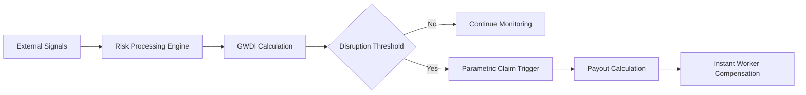
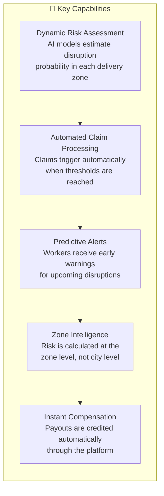
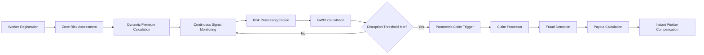
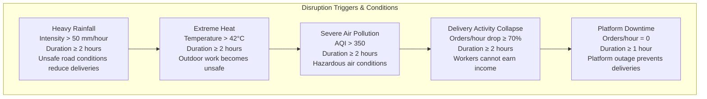
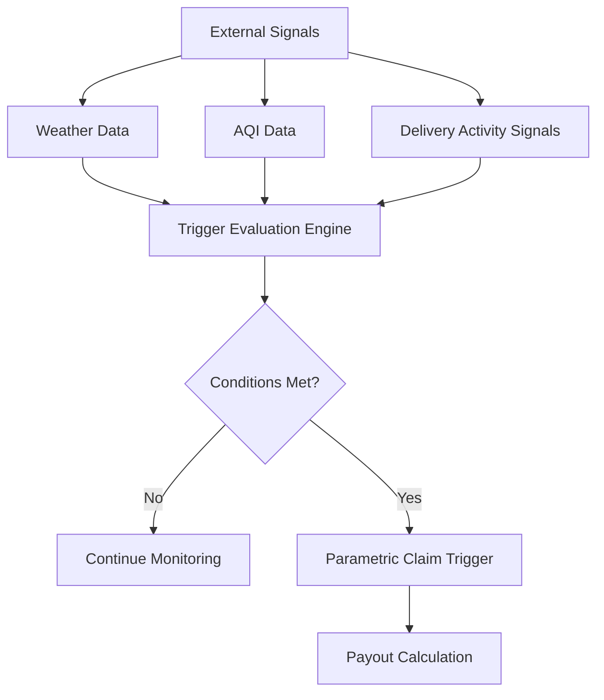
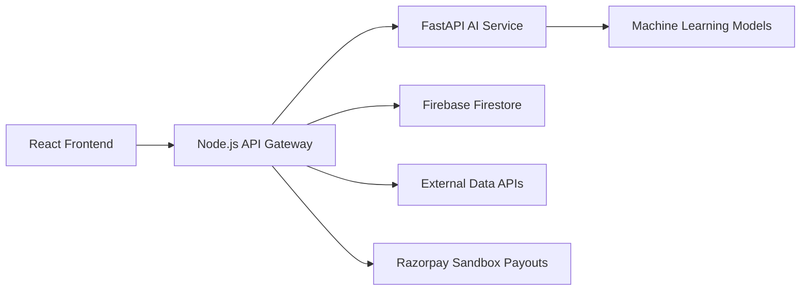
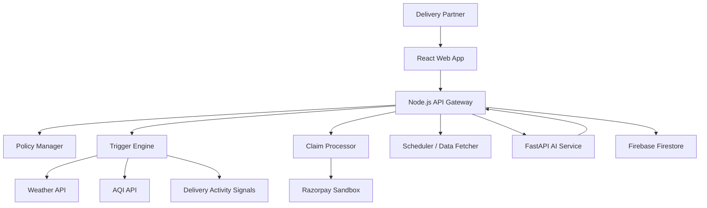
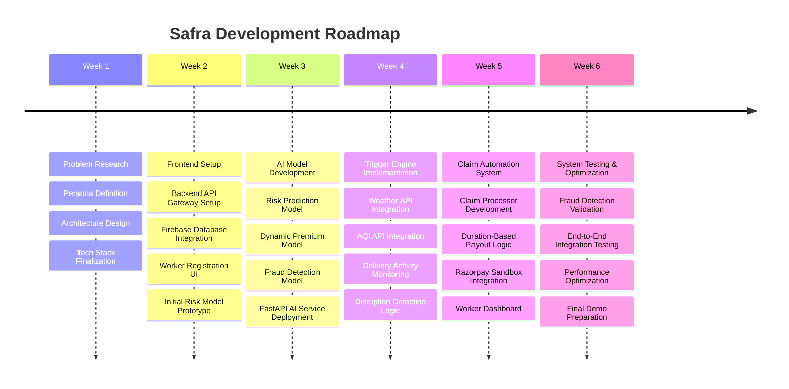

# Safra - AI-Powered Parametric Insurance for Gig Delivery Workers

Safra is an **AI-driven parametric micro-insurance platform** designed to protect the income of **quick-commerce delivery partners** working for platforms such as **Zepto, Blinkit, and Instamart**.

Gig delivery workers depend on continuous order flow to earn their daily income. However, external disruptions such as **extreme weather, severe air pollution, platform outages, or sudden delivery activity collapse** can instantly stop deliveries, causing riders to lose several hours of income.

Traditional insurance products are not designed to address **short-term income interruptions**, leaving gig workers financially vulnerable during these disruptions.

Safra solves this problem by introducing **automated parametric income protection**. Instead of requiring workers to file claims manually, the platform continuously monitors external signals such as **weather conditions, air quality levels, and delivery activity patterns**. When predefined disruption conditions are detected, Safra automatically triggers compensation.

The system combines **AI-driven risk assessment, dynamic premium pricing, automated disruption detection, and fraud monitoring** to create a scalable safety net for gig economy workers operating in unpredictable urban environments.

Safra does not just act as an insurance platform. By integrating **predictive disruption alerts, intelligent risk mapping, and worker assistance features**, the system helps riders make better decisions about **when and where to work**, enabling them to protect and stabilize their income.

## Project Overview

**Safra** is an AI-powered parametric insurance platform designed to protect the income of quick-commerce delivery partners working for platforms such as **Zepto, Blinkit, and Instamart**.

Delivery riders in the gig economy rely on completing a high number of short-distance deliveries throughout the day to earn their income. However, external disruptions such as **heavy rainfall, extreme heat, severe air pollution, delivery activity collapse, and platform downtime** can suddenly halt delivery operations. When this happens, riders lose valuable working hours and experience immediate income loss.

Safra addresses this problem by providing **automated weekly micro-insurance for income protection**. Workers enroll in the platform and receive dynamically priced coverage based on the **risk profile of their delivery zone** rather than broad city-level averages.

The platform continuously analyzes environmental and operational signals using a composite **Gig Worker Disruption Index (GWDI)**, which aggregates multiple real-time risk factors including:

- weather risk  
- air pollution levels  
- traffic and operational conditions  
- delivery activity trends  

By combining these signals, Safra calculates the probability of disruption events affecting delivery operations in a specific zone.

When predefined disruption conditions are detected—such as **heavy rainfall, extreme heat, severe pollution, delivery activity collapse, or platform downtime**—the system automatically triggers a parametric claim. Compensation is calculated based on the **duration of the disruption** and is credited to the worker without requiring manual claim submissions.

In addition to automated compensation, Safra also introduces **predictive disruption intelligence**. The system can forecast potential disruption risks before they occur and send alerts to workers, allowing them to:

- plan work schedules  
- switch to nearby zones with higher demand  
- temporarily pause work during unsafe conditions  

By combining **AI-driven risk modeling, dynamic pricing, predictive alerts, and automated payouts**, Safra creates a scalable financial protection system specifically designed for the operational realities of the gig economy.
## Target Persona

Safra is designed for **quick-commerce delivery partners working on platforms such as Zepto, Blinkit, and Instamart**. These riders operate in dense urban areas and complete multiple short-distance deliveries throughout the day.

A typical delivery partner works between **8–10 hours daily**, completing **2–4 deliveries per hour** within a small service radius of approximately **2–3 km**. Their earnings depend directly on the number of deliveries completed, making their income highly sensitive to interruptions in delivery operations.

External disruptions such as **heavy rainfall, extreme heat, severe air pollution, or platform downtime** can significantly reduce delivery demand or temporarily halt operations. During such periods, riders lose valuable working hours and experience immediate income loss.

Another major challenge riders face is **zone imbalance**, where too many riders operate in the same area, causing delivery opportunities to collapse even when demand exists elsewhere. Workers often have **little visibility into why their income suddenly drops**, making it difficult to adjust their working patterns.

Despite these risks, gig delivery workers typically **do not have access to insurance products that protect short-term income loss** caused by environmental or operational disruptions.

Safra specifically addresses this gap by providing **automated micro-insurance coverage and predictive risk insights** for gig delivery workers. In addition to financial protection, the platform helps riders make smarter work decisions by offering:

- **predictive disruption alerts**
- **zone-level risk insights**
- **demand shift notifications**
- **income protection during operational disruptions**

This approach ensures that riders not only receive compensation during disruptions but also gain tools that help them **optimize when and where they work**.
## Solution Overview

Safra is an **AI-powered parametric micro-insurance platform** designed to protect gig delivery workers from income loss caused by environmental and operational disruptions.

Instead of traditional claim-based insurance, Safra follows a **parametric model**. This means payouts are automatically triggered when predefined disruption conditions occur, eliminating paperwork and manual claim verification.

The system continuously analyzes real-time environmental and operational signals such as:

- weather conditions  
- air quality levels  
- delivery activity patterns  
- platform operational signals  

These signals are aggregated into a composite risk metric called the **Gig Worker Disruption Index (GWDI)**.

### Gig Worker Disruption Index (GWDI)

The **GWDI** represents the disruption risk in a delivery zone. It combines multiple risk factors into a single score between **0 and 1**.
GWDI =
0.35 × weather_risk +
0.25 × pollution_risk +
0.20 × traffic_risk +
0.20 × delivery_activity_drop

Higher GWDI values indicate a **greater probability of disruption** affecting delivery workers.

| GWDI Score | Risk Level | System Behavior |
|-------------|-------------|----------------|
| 0.0 – 0.3 | Low Risk | Normal operation |
| 0.3 – 0.6 | Moderate Risk | Monitoring + early alerts |
| 0.6 – 1.0 | High Risk | Disruption trigger likely |

### Predictive Disruption Intelligence

Unlike traditional insurance systems that react **after a disruption occurs**, Safra also provides **predictive risk alerts**.

When the system predicts a high disruption probability in the next few hours, workers receive notifications such as:

> “High rainfall risk expected in your zone in the next 2 hours.”

This allows riders to:

- plan work breaks  
- switch to nearby delivery zones  
- avoid unsafe working conditions  

### Automated Claim Triggering

When disruption thresholds are reached, Safra automatically triggers compensation.

No manual claim submission is required.



By combining predictive analytics, parametric triggers, and automated payouts, Safra transforms insurance from a reactive process into a real-time income protection system for gig workers.

## System Workflow

Safra operates through an automated workflow that continuously monitors disruption signals and compensates delivery partners when income loss occurs.

The platform integrates **worker registration, AI-driven risk assessment, disruption monitoring, and automated payouts** into a single pipeline.

### Workflow Steps

1. **Worker Registration**

Delivery partners register on the Safra platform and provide basic information such as:

- city
- delivery platform (Zepto, Blinkit, Instamart)
- operational delivery zone

This information is used to initialize the rider profile and policy configuration.

---

2. **Zone-Level Risk Assessment**

The system evaluates the operational risk of the rider’s delivery zone using historical and real-time data sources such as:

- rainfall trends  
- temperature patterns  
- air pollution levels  
- delivery activity signals  

An AI model generates a **risk score** representing the likelihood of disruption events in that zone.

---

3. **Dynamic Premium Calculation**

Based on the calculated risk score, Safra determines the **weekly insurance premium** for the worker.

Premiums are determined **per delivery zone**, not per city, ensuring fair pricing based on actual operational risk.

---

4. **Continuous Signal Monitoring**

Safra continuously monitors external data streams including:

- Weather APIs  
- Air Quality APIs  
- Delivery activity signals  
- platform operational signals  

These signals are evaluated periodically by the system to detect disruption conditions.

---

5. **Disruption Risk Analysis**

The monitored signals are processed by the **Risk Processing Engine**, which computes the **Gig Worker Disruption Index (GWDI)**.

The GWDI aggregates multiple environmental and operational signals into a single disruption probability score.

---

6. **Parametric Trigger Evaluation**

If disruption conditions persist beyond predefined thresholds, the system activates a **parametric trigger**.

Examples include:

- heavy rainfall
- extreme heat
- severe air pollution
- delivery activity collapse
- platform downtime

Only disruptions that persist long enough to meaningfully affect worker income activate claims.

---

7. **Automated Claim Processing**

Once a disruption is confirmed:

- the claim processor calculates compensation
- payout is determined based on **disruption duration**
- fraud checks are applied before payout approval

---

8. **Instant Compensation**

After verification, compensation is credited to the worker through the platform’s payout system.

This ensures that workers receive financial support **without filing manual claims**.

---

### Workflow Diagram


## Parametric Trigger System

Safra uses a **parametric insurance model**, where payouts are automatically triggered when predefined disruption conditions are detected.

Instead of requiring workers to manually file claims, the platform continuously monitors external signals and activates compensation when specific thresholds are met.

Each trigger is evaluated at regular intervals to determine whether a disruption has persisted long enough to meaningfully affect delivery operations.

Only **verified disruptions** trigger insurance payouts.

---

### Trigger Conditions

### Delivery Activity Collapse Trigger

One of the most important triggers in Safra is the **Order Collapse Trigger**, which reflects the real earning conditions of gig workers.

Instead of relying only on environmental data, Safra also monitors **delivery activity signals**.

Example:
average_orders_per_hour drops by 70%
for 2 consecutive hours


When this condition occurs, the system identifies that **workers are unable to earn income**, even if weather conditions are normal.

This ensures that Safra protects riders not only from environmental disruptions but also from **operational income collapse**.

---

### Multi-Signal Validation

To avoid false triggers, Safra validates disruption events using **multiple signal sources**.

Example:

- weather API confirmation  
- air quality API confirmation  
- delivery activity signal analysis  

This multi-source verification ensures that payouts are triggered **only when disruptions genuinely affect worker income**.

---

### Trigger Evaluation Pipeline


## Insurance Model

Safra follows a **weekly micro-insurance model** designed around the working patterns of gig delivery workers.

Most delivery partners operate on **weekly earning cycles**, so Safra provides simple weekly coverage plans that workers can subscribe to and renew easily.

The model combines **zone-based dynamic pricing**, **adaptive coverage plans**, and **duration-based payouts** to ensure both worker protection and system sustainability.

---

## Adaptive Weekly Coverage Plans

Safra offers multiple insurance tiers so workers can choose coverage based on their income level and risk tolerance.

| Plan | Weekly Premium | Coverage per Disruption Day |
|-----|----------------|-----------------------------|
| **Basic** | ₹20 | ₹200/day |
| **Standard** | ₹35 | ₹400/day |
| **Premium** | ₹50 | ₹700/day |

This tiered structure ensures flexibility while keeping the insurance affordable for gig workers.

---

## Zone-Based Premium Pricing

Unlike traditional insurance systems that price coverage at the **city level**, Safra calculates premiums based on **delivery zones**.

This allows the system to reflect real operational risk differences between neighborhoods.

Example factors used for zone pricing:

- historical rainfall patterns  
- air pollution levels  
- delivery activity volatility  
- traffic congestion trends  

Workers operating in **low-risk zones** benefit from lower premiums, while **high-risk zones** receive adjusted pricing with higher protection.

---

## Duration-Based Compensation

Safra calculates compensation **proportionally to the duration of disruption events**.

Instead of paying a fixed amount for the entire day, the system calculates payouts based on the number of working hours affected.

Example calculation:

| Parameter | Value |
|----------|------|
| Daily Coverage | ₹400 |
| Estimated Work Hours | 10 hours |
| Hourly Compensation | ₹40/hour |

If a disruption lasts **3 hours**, the worker receives:
Payout = 3 × ₹40 = ₹120

This ensures that compensation accurately reflects the **actual income loss duration**.

---

## Weekly Payout Limit

To maintain sustainability of the insurance pool, Safra applies a **maximum payout cap per worker per week**.

| Policy Limit | Value |
|--------------|------|
| Maximum Weekly Payout | **₹2000** |

This cap allows workers to receive meaningful protection while ensuring the long-term stability of the insurance system.

---

## Income Stabilization Objective

The goal of Safra is not to fully replace daily earnings but to provide **income stabilization** during disruptions.

By offering **affordable weekly premiums and automated payouts**, Safra ensures that gig workers can maintain financial stability even when delivery operations are temporarily interrupted.

## AI Components

Safra integrates multiple **AI-driven components** to improve disruption prediction, automate pricing decisions, and maintain the integrity of the insurance system.

These models enable the platform to adapt dynamically to environmental conditions, operational signals, and rider behavior patterns.

---

## 1. Risk Prediction Model

Safra uses a machine learning model to estimate the **disruption risk of a delivery zone**.

The model analyzes both environmental and operational signals to generate a **risk score between 0 and 1**.

### Example Input Features

| Feature | Description |
|-------|-------------|
| Rainfall Intensity | Real-time weather conditions |
| Temperature | Extreme heat detection |
| AQI Levels | Air pollution severity |
| Delivery Activity | Orders per hour in the zone |
| Traffic Conditions | Congestion and delivery delays |

The model outputs a **zone disruption probability**, which is used for pricing and predictive alerts.

---

## 2. Gig Worker Disruption Index (GWDI)

Safra aggregates multiple risk signals into a composite risk metric called the **Gig Worker Disruption Index (GWDI)**.
GWDI =
0.35 × weather_risk +
0.25 × pollution_risk +
0.20 × traffic_risk +
0.15 × supply_imbalance +
0.15 × activity_drop

This index allows the platform to evaluate disruption probability more accurately by combining multiple operational signals.

| GWDI Range | Risk Level | System Behavior |
|-----------|------------|----------------|
| 0.0 – 0.3 | Low Risk | Normal monitoring |
| 0.3 – 0.6 | Moderate Risk | Early warning alerts |
| 0.6 – 1.0 | High Risk | Disruption likely |

---

## 3. Oversupply Prediction Model

One major income disruption for gig workers occurs when **too many riders operate in the same zone**, reducing delivery opportunities.

Safra introduces an **Oversupply Prediction Model** that analyzes:

- historical rider density
- delivery demand patterns
- order arrival rates
- time-of-day trends

The system can predict **zone oversupply 1–2 hours ahead** and notify workers.

Example alert:

> “Your zone is oversupplied. Expected 40% fewer orders. Move 2 km to Zone B for higher demand.”

If a rider follows the recommendation and relocates, the system may provide:

- **Migration Boost**: ₹75–₹150 bonus on claim payout
- **Premium discount for the next week**

---

## 4. Dynamic Premium Calculation

The disruption risk score generated by the AI models is used to determine **weekly premium pricing**.

Premiums are calculated **per delivery zone**, not per city.

This ensures fair pricing based on the **actual operational risk of the worker’s environment**.

---

## 5. Fraud Detection Model

Safra includes an **AI-based anomaly detection system** that monitors claim patterns to prevent misuse.

### Fraud Signals

| Signal | Description |
|------|-------------|
| Abnormal claim frequency | Excessive claims from a single user |
| Data inconsistency | Trigger conditions not matching external signals |
| Duplicate claim attempts | Multiple claims for the same disruption |
| Suspicious activity patterns | Unusual operational behavior |

Suspicious cases are automatically flagged for review.

---

## 6. Rider Trust Score

Safra introduces a **Trust Score system** that evaluates the reliability of rider behavior.

The score improves when riders:

- follow predictive risk alerts
- report accurate network signals
- maintain consistent activity patterns

Benefits of high trust score:

- lower premiums
- access to **Income Buffer Advances**
- faster payout processing

If fraudulent behavior is detected, the system can:

- reduce trust score
- restrict policy access
- apply penalties or suspension

---

Together, these AI components allow Safra to combine **risk prediction, dynamic pricing, operational intelligence, and fraud prevention** into a unified decision-making system.
## Innovation Layer

Safra goes beyond traditional parametric insurance by introducing a set of **worker-centric intelligence systems** designed to actively support gig delivery workers.

These innovations transform Safra from a simple insurance product into a **real-time income protection and decision-support platform**.

---

## 1. Real-Time Risk Map Dashboard

Safra provides a **visual risk map** that shows disruption probability across different delivery zones.

Workers can instantly see which areas are safe to work in and which zones are likely to experience disruptions.

### Risk Map Indicators

| Color | Meaning |
|------|--------|
| 🟢 Green | Normal conditions |
| 🟡 Yellow | Moderate disruption risk |
| 🔴 Red | High disruption probability |
| 🟣 Purple | Rider oversupply detected |

This dashboard helps riders **choose optimal zones to maximize earnings**.

---

## 2. Oversupply Imbalance Protector (Zone Balancer)

One of the biggest challenges riders face is **oversupply of delivery workers in a zone**, which drastically reduces order availability.

Safra introduces an **AI-based Zone Balancer** that predicts oversupply conditions before they occur.

Example notification:

> “Your zone is oversupplied. Expected 40% fewer orders. Move 2 km to Zone B for higher demand.”

If a rider switches zones based on this recommendation, the system rewards them with:

- **Migration Boost:** ₹75–₹150 additional payout bonus  
- **10% premium discount for the next week**

This feature effectively acts as a **smart dispatcher for gig workers**, something most delivery platforms do not provide.

---

## 3. Predictive Disruption Alerts

Safra predicts disruptions **before they occur** using AI-based risk forecasting.

Example prediction:

> “Heavy rainfall expected in your zone within the next 2 hours.”

Workers can then:

- take scheduled breaks
- move to safer zones
- avoid unsafe delivery conditions

This transforms Safra into a **proactive worker assistance system**, not just reactive insurance.

---

## 4. Rider Network Early-Warning System

Safra introduces a **crowd-powered intelligence network** where riders can report real-time operational issues.

Workers can submit quick signals such as:

- “Low orders here”
- “Dark store delays”
- “Traffic blockage”

The system verifies these signals using external data and updates the **zone risk score** accordingly.

Participants receive **network participation benefits**, such as:

- **5–10% lower weekly premiums**
- more accurate disruption predictions

This feature builds a **collaborative intelligence layer across riders**.

---

## 5. Income Shield Weekly Report

Safra automatically generates a **weekly earnings impact report** for each rider.

Example report summary:

| Disruption Source | Income Lost |
|------------------|------------|
| Oversupply | ₹620 |
| Pollution | ₹480 |
| Rain | ₹240 |

The system then shows how much income Safra protected.

Example:

> “This week you lost ₹1340 due to disruptions. Safra compensated ₹920.”

Additionally, the system generates an **AI-based weekly work planner**.

Example suggestion:

> “Work 10 AM – 4 PM in Zone Y on Tuesday and Thursday for lowest disruption risk.”

This turns Safra into a **personal income optimization assistant**.

---

## 6. Pre-Disruption Income Buffer Advance

When the system predicts a high disruption probability (GWDI > 0.7), Safra offers workers an **instant small cash advance**.

Example notification:

> “Rain expected soon. Need ₹200 now? Instant credit available.”

### Buffer Advance Details

| Feature | Value |
|-------|------|
| Advance Range | ₹150 – ₹300 |
| Interest | 0% |
| Repayment | Automatically deducted from next payout |

Eligibility depends on the rider’s **Trust Score and active policy status**.

This feature directly addresses a real gig-worker problem:

> “I need money today, not after the disruption.”

---

## Why These Innovations Matter

These features position Safra as more than an insurance product.

Safra becomes a **real-time financial protection and intelligence system for gig workers**, combining:

- predictive disruption detection
- zone demand optimization
- collaborative rider intelligence
- instant financial assistance

This integrated approach helps stabilize income while empowering workers to make **better operational decisions in real time**.
## Technology Stack

Safra is designed using a **modular service-oriented architecture** that separates the user interface, backend logic, AI services, and data infrastructure.

This architecture allows the platform to efficiently process disruption signals, run machine learning models, and manage insurance operations at scale.

---

## Frontend

The user interface is built using **React**, providing a responsive web application that allows delivery partners to:

- register and enroll in insurance coverage  
- view policy details and coverage plans  
- track disruption alerts and payouts  
- view zone risk maps and recommendations  

The UI is optimized for **mobile devices**, as most delivery partners primarily access the system using smartphones.

---

## Backend API Gateway

The core backend services are implemented using **Node.js with Express**.

This layer acts as the main API gateway responsible for:

- user authentication and registration  
- policy creation and management  
- disruption trigger evaluation  
- payout calculation  
- communication with AI microservices  

Scheduled background jobs are used to continuously fetch environmental and operational data.

---

## AI Microservices

All machine learning components are implemented using **Python with FastAPI**.

This service hosts the AI models responsible for:

- disruption risk prediction  
- dynamic premium pricing  
- oversupply detection  
- fraud detection and anomaly analysis  

The Node.js backend communicates with the AI service through **REST APIs** whenever predictions or validations are required.

---

## Database

Safra uses **Firebase Firestore** as its primary cloud database.

Firestore stores structured records such as:

- user profiles  
- insurance policies  
- disruption monitoring logs  
- claim records  
- payout history  
- rider network signals  

Firestore provides **real-time updates and scalability**, which is important for disruption monitoring.

---

## External Data Sources

Safra integrates multiple external APIs to monitor environmental and operational signals.

| Data Source | Purpose |
|-------------|--------|
| Weather APIs | Rainfall and temperature monitoring |
| Air Quality APIs | AQI monitoring for pollution risks |
| Delivery Activity Signals | Order flow monitoring |
| Traffic Signals | Congestion and delivery delays |

These signals are used to compute the **Gig Worker Disruption Index (GWDI)**.

---

## Payment Simulation

For demonstration purposes, Safra integrates a **Razorpay sandbox payment gateway**.

This allows the platform to simulate:

- automated payouts  
- compensation transfers  
- income buffer advances  

Payments are triggered automatically when disruption claims are approved.

---

## System Flow Overview


This modular stack enables Safra to combine real-time monitoring, AI-based risk evaluation, automated claims, and instant compensation within a scalable system architecture.

## System Architecture

Safra follows a **modular service-oriented architecture** that separates the user interface, backend services, AI computation, and data storage.

This architecture ensures scalability, maintainability, and efficient real-time monitoring of disruption signals affecting gig delivery workers.

---

## System Architecture

Safra follows a **modular service-oriented architecture** that separates the user interface, backend services, AI computation, and data storage.

This architecture ensures scalability, maintainability, and efficient real-time monitoring of disruption signals affecting gig delivery workers.

---

## High-Level Architecture


---

## Architecture Layers

### 1. User Layer
The delivery partner interacts with the system through the mobile-friendly React web application.

Workers can:
- Register and enroll in insurance
- View policy coverage
- Track disruption alerts
- Monitor compensation payouts

### 2. Frontend Layer
The React frontend provides the user interface and communicates with backend services through secure API requests.

Key frontend components include:
- Worker dashboard
- Policy management interface
- Disruption alert notifications
- Risk map visualization

### 3. API Gateway Layer
The Node.js + Express backend acts as the central coordination layer of the platform.

Responsibilities include:
- Authentication and user management
- Policy management
- Disruption trigger evaluation
- Payout processing
- Communication with AI services

> The backend also runs scheduled monitoring jobs that fetch environmental and operational data.

### 4. AI Service Layer
Machine learning models are hosted in a separate FastAPI microservice.

These models perform:
- Disruption risk prediction
- GWDI calculation
- Oversupply detection
- Fraud detection

> Separating AI services ensures the platform remains scalable and modular.

### 5. Data Layer
Safra stores all application data in **Firebase Firestore**.

Key stored data includes:
- User profiles
- Policy details
- Disruption logs
- Claim history
- Payout records

> Firestore allows real-time updates and scalable cloud storage.

### 6. External Data Layer
The platform integrates multiple external APIs to monitor disruption signals affecting delivery operations.

These include:
- Weather APIs
- Air quality APIs
- Delivery activity signals

> These signals feed into the **Trigger Engine**, which evaluates parametric insurance conditions.

### 7. Payment Layer
Once a disruption claim is approved, Safra triggers compensation through the **Razorpay sandbox** payment system.

> This allows instant payout simulation during demonstrations.

---

## Architecture Flow Summary
```
React Frontend
      ↓
Node.js API Gateway
      ↓
FastAPI AI Services
      ↓
Firebase Firestore
      ↓
Razorpay Payment System
```

---

This layered architecture enables Safra to deliver **real-time disruption monitoring**, **automated insurance claims**, and **instant compensation** for gig delivery workers.

## Future Scope

While Safra demonstrates the core concept of automated parametric insurance for gig workers, the platform can be extended significantly to improve accuracy, scalability, and real-world adoption.

Future development can expand the system across data sources, platform integrations, and advanced predictive capabilities.

---

## Advanced Risk Modeling

Future versions of Safra can incorporate **larger historical datasets** to improve disruption prediction accuracy.

Potential improvements include:

- long-term weather pattern analysis  
- seasonal disruption modeling  
- city-level environmental risk profiling  
- traffic congestion forecasting  

These additions would allow the AI system to generate **more precise risk scores and premium pricing**.

---

## Direct Platform Integrations

Safra can integrate directly with quick-commerce platforms such as:

- Zepto  
- Blinkit  
- Instamart  

This would allow the system to access **real-time operational signals**, including:

- live order flow
- rider density
- dark store delays
- platform outages

Such integrations would greatly improve **disruption detection accuracy**.

---

## Multi-City Expansion

The system can be expanded to support **multiple cities and metropolitan regions**.

Each city can have:

- customized environmental risk models  
- localized disruption thresholds  
- city-specific delivery activity patterns  

This enables Safra to scale across **different urban environments**.

---

## Real-Time Payment Infrastructure

Future implementations can integrate production-grade payout infrastructure such as:

- digital wallets
- instant bank transfers
- UPI-based compensation

This would enable **instant compensation transfers** to delivery partners when disruption events occur.

---

## Advanced Rider Intelligence Tools

Safra can evolve into a full **gig-worker intelligence platform**.

Potential additions include:

- real-time demand forecasting  
- rider workload optimization  
- smart shift planning recommendations  
- earnings prediction dashboards  

These tools would help riders make **data-driven decisions about when and where to work**.

---

## Expanded Coverage Models

Future versions of Safra could introduce **multiple insurance products**, such as:

| Coverage Type | Description |
|---------------|-------------|
| Income Protection | Current disruption-based coverage |
| Health Risk Coverage | Protection during extreme pollution or heat |
| Equipment Protection | Coverage for damaged delivery equipment |
| Accident Coverage | Protection during delivery operations |

This would transform Safra into a **comprehensive insurance ecosystem for gig workers**.

---

By expanding its data sources, AI capabilities, and financial infrastructure, Safra has the potential to become a **scalable insurance and intelligence platform designed specifically for the gig economy**.
## Development Roadmap

The development of Safra follows a phased roadmap that gradually builds the core components of the platform. Each phase focuses on implementing and integrating key capabilities, from initial research and system architecture to disruption detection and automated payouts.

---

## Safra Development Timeline


