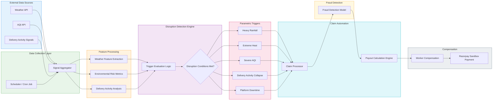
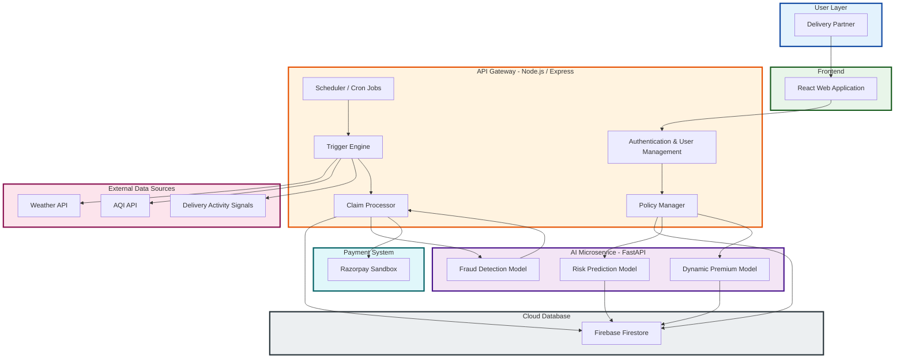
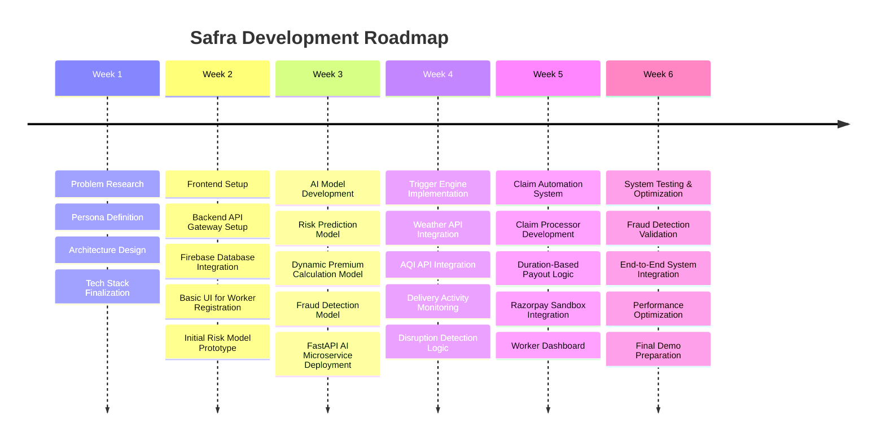

## Project Overview

**Safra** is an AI-powered parametric insurance platform designed to protect the income of quick-commerce delivery partners working for platforms such as **Zepto, Blinkit, and Instamart**.

Delivery riders in the gig economy rely on continuous deliveries to earn their daily income. However, external disruptions such as **extreme weather, severe air pollution, and platform downtime** can instantly stop deliveries, causing workers to lose a significant portion of their earnings. Currently, gig workers have little to no financial protection against these uncontrollable events.

Safra addresses this challenge by providing **automated weekly micro-insurance for income loss**. Riders enroll in the platform and receive dynamically priced insurance coverage based on the operational risk of their delivery zone. The system continuously monitors real-time environmental conditions and platform activity using external data sources such as weather APIs, air quality indices, and delivery activity signals.

When predefined disruption conditions occur—such as **heavy rainfall, extreme heat, severe pollution, delivery activity collapse, or platform downtime**—Safra automatically triggers a parametric claim. Compensation is calculated based on the duration of the disruption and is credited to the worker without requiring manual claim submissions.

By combining **AI-driven risk assessment, dynamic premium pricing, automated disruption detection, and fraud monitoring**, Safra provides a scalable safety net for gig economy workers and helps stabilize their income in unpredictable urban environments.

## Target Persona

Safra is designed for **quick-commerce delivery partners working on platforms such as Zepto, Blinkit, and Instamart**. These riders operate in dense urban areas and complete multiple short-distance deliveries throughout the day.

A typical delivery partner works between **8–10 hours daily**, completing **2–4 deliveries per hour** within a small service radius of approximately **2–3 km**. Their earnings depend directly on the number of deliveries completed, making their income highly sensitive to interruptions in delivery operations.

External disruptions such as **heavy rainfall, extreme heat, severe air pollution, or platform downtime** can significantly reduce delivery demand or temporarily halt operations altogether. During such periods, riders lose valuable working hours and experience immediate income loss.

Despite these risks, gig delivery workers typically **do not have access to insurance products that protect short-term income loss** caused by environmental or operational disruptions.

Safra specifically addresses this gap by providing **automated micro-insurance coverage for gig delivery workers**, ensuring that riders receive financial compensation when external disruptions prevent them from working.

## Solution Overview

Safra is an AI-powered parametric micro-insurance platform designed to protect gig delivery workers from income loss caused by external disruptions. The platform provides delivery partners with a simple weekly insurance plan that automatically compensates them when events beyond their control prevent them from working.

Delivery partners can register on the platform and enroll in a weekly insurance plan. Safra uses AI-driven risk assessment to determine a dynamic premium based on the operational risk of the rider’s delivery zone. This ensures that workers operating in higher-risk areas receive appropriate coverage while maintaining fair pricing.

Once a rider is enrolled, the system continuously monitors multiple external data signals such as weather conditions, air quality levels, and delivery activity patterns. Safra identifies disruption events using predefined parametric triggers, including heavy rainfall, extreme heat, severe air pollution, delivery activity collapse, and platform downtime.

When a disruption is detected and persists beyond the defined threshold, the system automatically triggers a claim. The payout is calculated based on the duration of the disruption and credited to the worker without requiring manual claim submissions.

By combining automated disruption detection, dynamic risk-based pricing, and instant claim processing, Safra creates a scalable insurance model that provides gig workers with reliable financial protection during unpredictable operational disruptions.

## System Workflow

The Safra platform operates through an automated workflow that continuously monitors disruption conditions and compensates delivery partners when income loss occurs.

### 1. Worker Registration
Delivery partners sign up on the Safra platform and provide basic details such as their city, delivery platform (e.g., Zepto), and operational zone.

### 2. Risk Assessment
The system evaluates the operational risk of the worker’s delivery zone using historical environmental and activity data. An AI-based risk model generates a **risk score** that represents the likelihood of disruptions in that area.

### 3. Dynamic Premium Calculation
Based on the risk score, Safra calculates a **weekly insurance premium**. Workers operating in safer zones pay lower premiums, while those in higher-risk areas receive adjusted pricing and coverage.

### 4. Continuous Disruption Monitoring
After enrollment, Safra continuously monitors external signals using integrated data sources such as:

- Weather conditions (rainfall, temperature)
- Air quality levels (AQI)
- Delivery activity patterns
- Platform operational status

This monitoring is performed at regular intervals to detect disruption events affecting delivery operations.

### 5. Parametric Trigger Detection
When predefined conditions are met—such as prolonged heavy rainfall, extreme heat, severe air pollution, delivery activity collapse, or platform downtime—the system identifies a disruption event. These triggers are validated using duration thresholds to ensure that only meaningful disruptions activate claims.

### 6. Disruption Detection & Claim Automation Pipeline
Once a disruption is confirmed, Safra automatically calculates the payout based on the duration of the disruption and the worker’s coverage plan.

### 7. Instant Compensation
The calculated compensation is credited to the worker through the platform’s payout system, ensuring that delivery partners receive financial support without needing to manually file claims.

## Parametric Trigger System

Safra uses a **parametric insurance model**, where payouts are automatically triggered when predefined disruption conditions are detected. Instead of requiring workers to manually file claims, the platform continuously monitors external signals and activates compensation when specific thresholds are met.

Each trigger is evaluated at regular intervals to determine whether a disruption has persisted long enough to affect delivery operations. This ensures that only meaningful disruptions result in insurance payouts.

The system monitors the following disruption triggers:

### 1. Heavy Rainfall
Heavy rainfall can significantly impact road conditions and reduce delivery activity.

**Trigger Condition:**
- Rainfall intensity greater than **50 mm/hour**
- Persists for **at least 2 consecutive hours**

### 2. Extreme Heat
High temperatures can create unsafe working conditions for delivery partners and reduce operational capacity.

**Trigger Condition:**
- Temperature greater than **42°C**
- Persists for **at least 2 consecutive hours**

### 3. Severe Air Pollution
Dangerously high air pollution levels can make outdoor work hazardous and reduce delivery operations.

**Trigger Condition:**
- Air Quality Index (AQI) greater than **350**
- Persists for **at least 2 consecutive hours**

### 4. Delivery Activity Collapse
A sudden drop in delivery activity indicates that workers are unable to earn income due to operational disruptions.

**Trigger Condition:**
- Delivery orders per hour drop by **70% or more**
- Persists for **at least 2 consecutive hours**

### 5. Platform Downtime
Platform outages or system failures can prevent riders from receiving orders.

**Trigger Condition:**
- Delivery orders per hour equal **zero**
- Persists for **at least 1 hour**

By combining environmental signals with operational data, Safra ensures that compensation is triggered only when disruptions genuinely affect a worker’s ability to earn income.

## Insurance Model

Safra follows a **weekly micro-insurance model** tailored to the working patterns of gig delivery workers. Since most delivery partners operate on weekly earning cycles, the platform provides a simple and flexible insurance plan that workers can subscribe to on a weekly basis.

### Weekly Premium

Safra uses an **AI-driven dynamic pricing model** to determine the weekly premium for each worker. The premium is calculated based on the operational risk of the rider’s delivery zone.

Workers operating in areas with higher historical disruption risk (such as frequent heavy rainfall or severe pollution) may receive slightly higher premiums, while riders in lower-risk zones benefit from reduced pricing.

Typical premium range:

- **Low Risk Zones:** ₹20 / week  
- **Moderate Risk Zones:** ₹30 / week  
- **High Risk Zones:** ₹45 / week  

### Coverage Amount

Each enrolled worker receives coverage for **income loss caused by disruption events**. Safra provides protection of:

**₹400 per disruption day**

This amount represents partial income replacement to support delivery partners during operational interruptions.

### Duration-Based Compensation

Safra calculates compensation **proportionally to the duration of the disruption**. Instead of paying a fixed amount for the entire day, the system calculates payouts based on how long the disruption affects delivery activity.

Example calculation:

- Daily coverage: **₹400**
- Estimated working hours: **10 hours**
- Hourly compensation: **₹40 per hour**

If a disruption lasts **3 hours**, the worker receives:

### Weekly Payout Limit

To ensure sustainability of the insurance pool, Safra defines a **maximum payout cap per worker per week**.

**Maximum weekly payout: ₹2000**

This structure allows workers to receive meaningful support during disruptions while maintaining a balanced and scalable insurance model.

## AI Components

Safra integrates multiple AI-driven components to improve risk assessment, automate pricing decisions, and maintain the integrity of the insurance system. These components enable the platform to dynamically adapt to environmental and operational conditions affecting gig delivery workers.

### 1. Risk Prediction Model

Safra uses a machine learning model to estimate the **disruption risk of a delivery zone**. The model analyzes environmental and operational data to produce a **risk score** representing the likelihood of disruption events.

Example input features include:

- Historical rainfall patterns
- Temperature trends
- Air Quality Index (AQI)
- Delivery activity levels
- Zone-specific environmental risks

The model outputs a **risk score between 0 and 1**, which represents the probability of disruption in the worker’s operational area.

### 2. Dynamic Premium Calculation

The calculated risk score is used to determine the **weekly insurance premium** for each worker. This ensures that pricing is proportional to the risk exposure of the delivery zone.

Workers operating in safer zones receive **lower premiums**, while those in high-risk zones are priced accordingly to maintain the sustainability of the insurance pool.

This dynamic pricing approach ensures fairness while enabling Safra to scale across different cities and operational environments.

### 3. Fraud Detection System

To prevent misuse of the insurance system, Safra incorporates an **AI-based fraud detection mechanism** that analyzes claim patterns and operational data.

The system evaluates signals such as:

- abnormal claim frequency
- inconsistencies between environmental data and claim triggers
- unusual delivery activity patterns
- duplicate claim attempts

An anomaly detection model identifies suspicious claims and flags them for further verification, helping maintain trust and stability in the platform.

Together, these AI components enable Safra to deliver a reliable, automated insurance experience while ensuring that payouts are fair, accurate, and resistant to fraud.

## Technology Stack

Safra is designed using a modular architecture that separates application logic, AI processing, and data storage. This approach allows the system to efficiently process disruption signals, run machine learning models, and manage insurance operations.

### Frontend

The user interface is built using **React**, providing a responsive web application that allows delivery partners to:

- Register and enroll in insurance coverage
- View their policy details
- Monitor disruption events and payouts

The interface is designed to be **mobile-friendly**, ensuring accessibility for gig workers who primarily use smartphones.

### Backend API Gateway

The core backend services are implemented using **Node.js with Express**. This layer acts as the main API gateway responsible for handling:

- user authentication and registration
- policy creation and management
- disruption trigger evaluation
- payout calculation
- communication with AI services

Express middleware is used to manage request handling, validation, and orchestration between system components.

### AI Microservices

All machine learning components are implemented using **Python with FastAPI**. This service is responsible for running AI models that support the insurance system.

These models perform tasks such as:

- disruption risk prediction for delivery zones
- dynamic premium calculation
- anomaly detection for fraud prevention

The FastAPI service exposes endpoints that allow the Node.js backend to request predictions and validations from the AI models.

### Database

Safra uses **Firebase Firestore** as its primary cloud database. Firestore stores structured application data including:

- user profiles
- insurance policies
- disruption monitoring logs
- claim records
- payout history

Firebase is chosen for its scalability, real-time capabilities, and ease of integration with web applications.

### External Data Sources

The platform integrates multiple external APIs to monitor environmental and operational signals, including:

- **Weather APIs** for rainfall and temperature data
- **Air Quality APIs** for AQI monitoring
- **Delivery activity signals** for detecting operational disruptions

These data streams allow Safra to continuously evaluate disruption conditions and trigger automated claims when necessary.

### Payment Simulation

For demonstration purposes, Safra integrates a **payment gateway sandbox (such as Razorpay test mode)** to simulate instant payouts to delivery partners.

## System Architecture Overview

Safra follows a modular service-oriented architecture that separates the user interface, application logic, AI services, and data storage. This design ensures that the system remains scalable, maintainable, and capable of processing disruption signals in real time.

## System Architecture

> **Figure:** High-level architecture of Safra showing the interaction between the React client, Node.js API gateway, FastAPI AI services, Firebase data layer, and external disruption signals used for parametric insurance triggers.

### Frontend Layer

The **React frontend** provides the user interface for delivery partners. Through this interface, workers can register, enroll in weekly insurance coverage, view their policy details, and track disruption-triggered payouts. The frontend communicates with the backend through secure API requests.

### API Gateway Layer

The **Node.js + Express backend** acts as the main API gateway of the platform. This layer is responsible for coordinating the core business logic of the system, including:

- user registration and authentication
- insurance policy management
- disruption trigger evaluation
- payout calculation
- communication with AI services

The backend also runs scheduled tasks that periodically fetch environmental and operational data required for disruption monitoring.

### AI Service Layer

Machine learning models are hosted as a separate **FastAPI-based AI microservice**. This service handles all AI-related computations, including:

- disruption risk prediction
- dynamic premium calculation
- fraud detection and anomaly analysis

The Node.js backend communicates with this service through REST APIs whenever AI predictions are required.

### Data Layer

All platform data is stored in **Firebase Firestore**, which manages structured records such as:

- user profiles
- insurance policies
- disruption monitoring logs
- claims and payouts

Firestore enables scalable data storage and supports real-time updates when disruption events are detected.

### External Data Integration

Safra continuously integrates external data sources to monitor disruption signals affecting delivery operations. These include:

- weather APIs for rainfall and temperature data
- air quality APIs for AQI monitoring
- delivery activity signals used to detect operational disruptions

These signals feed into the disruption detection engine, allowing the system to automatically evaluate trigger conditions.

### System Flow

The high-level architecture flow of Safra is:

React Frontend
↓
Node.js / Express API Gateway
↓
FastAPI AI Microservices
↓
Firebase Firestore Database

This architecture enables Safra to automate disruption detection, process insurance claims, and deliver payouts efficiently while maintaining a clear separation between application logic and AI computation.

## Future Scope

While Safra demonstrates the core concept of automated parametric insurance for gig workers, the platform can be extended in several ways to improve accuracy, scalability, and real-world adoption.

### Advanced Risk Modeling

Future versions of Safra can incorporate larger historical datasets to improve the accuracy of disruption risk prediction. Integrating long-term weather patterns, seasonal trends, and city-level operational data would allow the platform to generate more precise premium pricing and risk assessments.

### Real Platform Integrations

Safra can integrate directly with delivery platforms such as Zepto, Blinkit, or Instamart to access real-time operational signals. This would enable more reliable detection of delivery activity disruptions and reduce reliance on simulated datasets.

### Expanded Coverage Models

The insurance model can be expanded to support multiple coverage tiers, allowing workers to choose different levels of protection based on their income patterns and work schedules.

### Geographic Expansion

The system can be extended to support multiple cities and regions by incorporating location-specific environmental risk models and regional disruption datasets.

### Real-Time Payout Infrastructure

Future implementations can integrate production-grade payment systems and digital wallets to enable instant compensation transfers to delivery partners when disruption events are detected.

By continuously improving its data sources, AI models, and platform integrations, Safra has the potential to evolve into a scalable insurance infrastructure designed specifically for the rapidly growing gig economy.

## Development Roadmap

The development of Safra is structured as a phased roadmap that gradually builds the core components of the platform. Each stage focuses on implementing and integrating key system capabilities, from initial research and architecture design to disruption detection and automated payouts.

### Safra Development Roadmap

