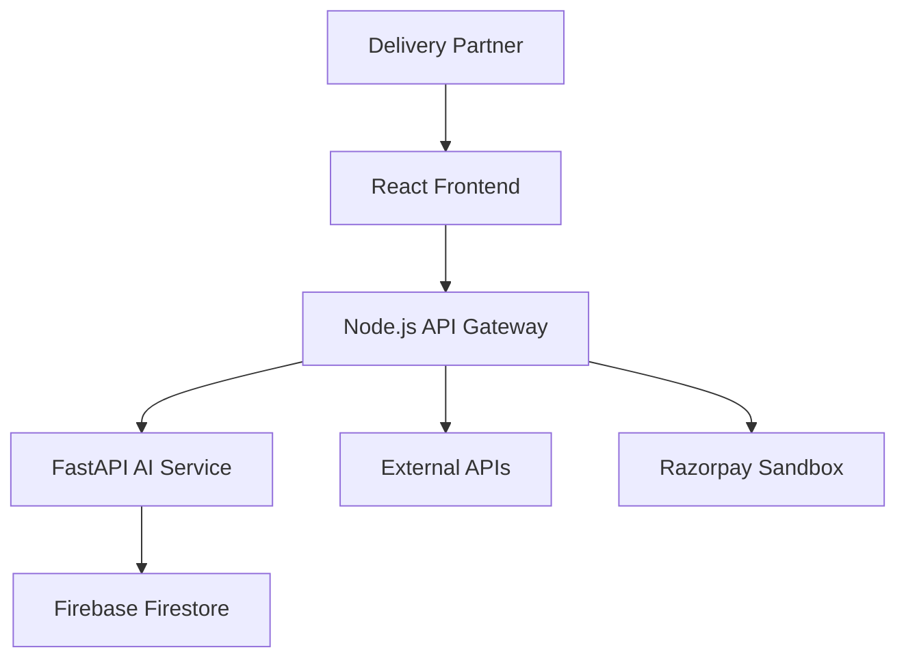
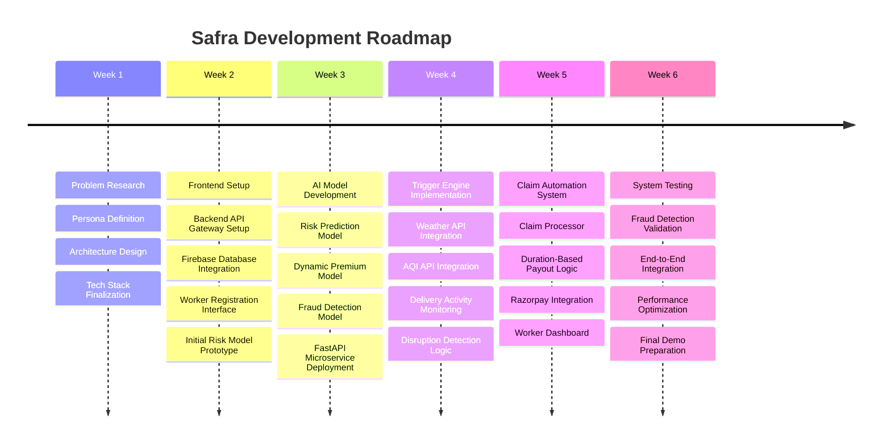

# Safra – AI-Powered Income Protection for Gig Delivery Workers

## Project Overview

**Safra** is an AI-powered parametric insurance platform designed to protect the income of quick-commerce delivery partners working for platforms such as **Zepto, Blinkit, and Instamart**.

Delivery riders in the gig economy rely on continuous deliveries to earn their daily income. However, external disruptions such as **extreme weather, severe air pollution, traffic congestion, rider oversupply, and platform downtime** can instantly stop deliveries, causing workers to lose a significant portion of their earnings.

Currently, gig workers have little to no financial protection against these uncontrollable events.

Safra addresses this challenge by providing **automated weekly micro-insurance for income loss**. Riders enroll in the platform and receive dynamically priced insurance coverage based on the operational risk of their delivery zone.

The system continuously monitors real-time environmental conditions and platform activity using external data sources such as **weather APIs, air quality indices, traffic signals, and delivery activity signals**.

When predefined disruption conditions occur—such as **heavy rainfall, extreme heat, severe pollution, delivery activity collapse, or platform downtime**—Safra automatically triggers a parametric claim. Compensation is calculated based on the duration of the disruption and is credited to the worker without requiring manual claim submissions.

By combining **AI-driven risk assessment, dynamic premium pricing, automated disruption detection, predictive alerts, and fraud monitoring**, Safra provides a scalable safety net for gig economy workers and helps stabilize their income in unpredictable urban environments.

---

# Target Persona

Safra is designed for **quick-commerce delivery partners working on platforms such as Zepto, Blinkit, and Instamart**.

These riders operate in dense urban areas and complete multiple short-distance deliveries throughout the day.

A typical delivery partner:

- Works **8–10 hours daily**
- Completes **2–4 deliveries per hour**
- Operates within a **2–3 km delivery radius**

Their earnings depend directly on the **number of deliveries completed**, making their income highly sensitive to interruptions in delivery operations.

External disruptions such as:

- heavy rainfall  
- extreme heat  
- severe air pollution  
- traffic congestion  
- rider oversupply  
- platform downtime  

can significantly reduce delivery demand or temporarily halt operations altogether.

During such periods, riders lose valuable working hours and experience **immediate income loss**.

Despite these risks, gig delivery workers typically **do not have access to insurance products that protect short-term income loss caused by environmental or operational disruptions**.

Safra specifically addresses this gap by providing **automated micro-insurance coverage for gig delivery workers**, ensuring that riders receive financial compensation when external disruptions prevent them from working.

---

# Solution Overview

Safra is an **AI-powered parametric micro-insurance platform** designed to protect gig delivery workers from income loss caused by external disruptions.

The platform provides delivery partners with a **simple weekly insurance plan** that automatically compensates them when events beyond their control prevent them from working.

Delivery partners can register on the platform and enroll in a weekly insurance plan. Safra uses **AI-driven risk assessment** to determine a dynamic premium based on the operational risk of the rider’s delivery zone.

Once a rider is enrolled, the system continuously monitors multiple external data signals such as:

- weather conditions
- air quality levels
- traffic signals
- delivery activity patterns

Safra identifies disruption events using **predefined parametric triggers**, including heavy rainfall, extreme heat, severe air pollution, delivery activity collapse, and platform downtime.

When a disruption is detected and persists beyond the defined threshold, the system automatically triggers a claim. The payout is calculated based on the **duration of the disruption** and credited to the worker without requiring manual claim submissions.

---

# System Workflow

The Safra platform operates through an automated workflow that continuously monitors disruption conditions and compensates delivery partners when income loss occurs.

### 1. Worker Registration

Delivery partners sign up on the Safra platform and provide basic details such as:

- city
- delivery platform (Zepto, Blinkit, Instamart)
- operational delivery zone

---

### 2. Risk Assessment

The system evaluates the operational risk of the worker’s delivery zone using historical environmental and delivery activity data.

---

### 3. Predictive Risk Alerts

Safra introduces predictive intelligence to notify workers about potential disruptions **before they happen**.

For example:

If the system predicts a **high probability of rainfall within the next two hours**, the worker receives a notification:

> "High disruption risk expected in your zone in the next two hours."

Workers can:

- plan breaks
- switch zones
- adjust schedules

---

### 4. Dynamic Premium Calculation

Based on the calculated risk score, Safra determines the **weekly insurance premium** for the worker.

---

### 5. Continuous Disruption Monitoring

The system continuously monitors:

- Weather conditions
- Air Quality levels
- Traffic patterns
- Delivery activity signals
- Rider supply levels

---

### 6. Parametric Trigger Detection

When predefined disruption conditions are met, the system confirms the disruption event.

---

### 7. Claim Automation

The payout is calculated automatically based on **disruption duration**.

---

### 8. Instant Compensation

The calculated compensation is credited to the worker via the payout system without requiring manual claim submissions.

---

# Gig Worker Disruption Index (GWDI)

Instead of evaluating each disruption signal independently, Safra introduces the **Gig Worker Disruption Index (GWDI)**.

GWDI combines multiple operational risk indicators into a **single disruption probability score**.

```
GWDI =
0.35 * weather_risk +
0.25 * pollution_risk +
0.20 * traffic_risk +
0.10 * supply_imbalance +
0.10 * delivery_activity_drop
```

Where:

- **weather_risk** → rainfall intensity, storms, extreme heat
- **pollution_risk** → AQI levels affecting outdoor work
- **traffic_risk** → congestion impacting delivery efficiency
- **supply_imbalance** → rider oversupply in a delivery zone
- **delivery_activity_drop** → sudden decrease in order demand

Higher GWDI values indicate a **greater probability of income disruption** for delivery workers.

---

# Parametric Trigger System

Safra follows a **parametric insurance model**, where payouts are automatically triggered when predefined disruption conditions are detected.

### Heavy Rainfall

Rainfall greater than **50 mm/hour for 2 hours**

---

### Extreme Heat

Temperature exceeding **42°C for 2 hours**

---

### Severe Air Pollution

Air Quality Index exceeding **350 for 2 hours**

---

### Delivery Activity Collapse

If the **average orders per hour drop by more than 70% for two consecutive hours**, the system identifies it as a **delivery activity collapse**.

This trigger directly reflects **income loss caused by reduced delivery demand**.

---

### Platform Downtime

If delivery orders drop to **zero for one hour**, the system identifies this as **platform downtime**.

---

# Insurance Model

Safra follows a **weekly micro-insurance model**.

### Zone-Based Premium Calculation

Premiums are calculated **per delivery zone rather than per city** to reflect localized operational risks.

---

### Weekly Premium Range

- Low Risk Zones → ₹20
- Medium Risk Zones → ₹30
- High Risk Zones → ₹45

---

### Coverage Amount

Safra provides:

**₹400 per disruption day**

---

### Weekly Payout Limit

Maximum payout per week:

**₹2000**

---

### Adaptive Weekly Coverage Plans

| Plan | Weekly Premium | Coverage |
|-----|-----|-----|
| Basic | ₹20 | ₹200/day |
| Standard | ₹35 | ₹400/day |
| Premium | ₹50 | ₹700/day |

Workers can choose coverage depending on their expected working hours and risk tolerance.

---

# Advanced Innovation Layer

### Oversupply Imbalance Protection

Rider oversupply in a delivery zone can significantly reduce earnings.

Safra detects oversupply using rider density signals.

If oversupply is detected:

Workers receive notifications such as:

> "Your zone is oversupplied. Switching to Zone B may increase delivery demand by 35%."

Workers who relocate may receive **migration rewards or premium discounts**.

---

### Worker Trust Score

Safra assigns a **Trust Score** to riders similar to financial credit scoring systems.

The score is based on:

- policy compliance
- accurate reporting
- participation in the rider network

Higher trust scores unlock:

- lower premiums
- faster claim processing
- access to financial support features

---

### Rider Network Early Warning System

Workers can submit quick reports such as:

- low orders in zone
- traffic congestion
- store delays

Multiple reports are verified and used to update disruption risk levels.

This creates a **crowd-powered intelligence network** that improves prediction accuracy.

---

### Real-Time Risk Map Dashboard

Safra provides a **visual disruption risk map**.

Color codes:

Green → Normal conditions  
Yellow → Moderate disruption risk  
Red → High disruption risk  
Purple → Rider oversupply detected  

Workers can quickly identify **safer working zones**.

---

### Income Shield Weekly Report

At the end of each week Safra generates an **Income Shield Report** showing:

- income lost due to rainfall disruptions
- income lost due to severe air pollution
- income lost due to rider oversupply
- compensation received from Safra

The system also generates an **AI-powered weekly work planner** suggesting optimal working hours and zones.

---

### Pre-Disruption Income Buffer

When Safra predicts a major disruption event, the system may offer a **small income advance**.

Example:

> "Rain disruption predicted in 2 hours. Would you like a ₹200 income buffer?"

This helps workers cover **fuel and daily expenses** during disruptions.

The advance is automatically adjusted against future payouts.

---

# AI Components

### Risk Prediction Model

Machine learning models estimate disruption risk using:

- rainfall forecasts
- temperature trends
- AQI levels
- delivery activity patterns

The model outputs a **risk score between 0 and 1**.

---

### Dynamic Premium Model

Premiums are dynamically calculated based on the predicted disruption probability of a zone.

---

### Fraud Detection System

An anomaly detection system evaluates:

- abnormal claim frequency
- inconsistencies between signals and triggers
- duplicate claim attempts

If a **security breach or fraud attempt is detected**, Safra may deactivate accounts and apply penalties to protect the insurance pool.

---

# Technology Stack

Frontend  
React

Backend API Gateway  
Node.js + Express

AI Microservices  
Python FastAPI

Database  
Firebase Firestore

External Data Sources

- Weather APIs
- Air Quality APIs
- Delivery Activity Signals

Payments  
Razorpay Sandbox

---

# System Architecture



---

# Future Scope

Safra can expand to support:

- ride-hailing drivers
- courier workers
- logistics gig workers

Future improvements include:

- blockchain-based claim transparency
- deeper integration with gig platforms
- improved predictive risk modeling
- real-time wallet payouts

---

# Development Roadmap

