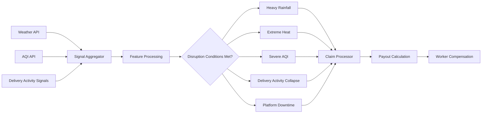
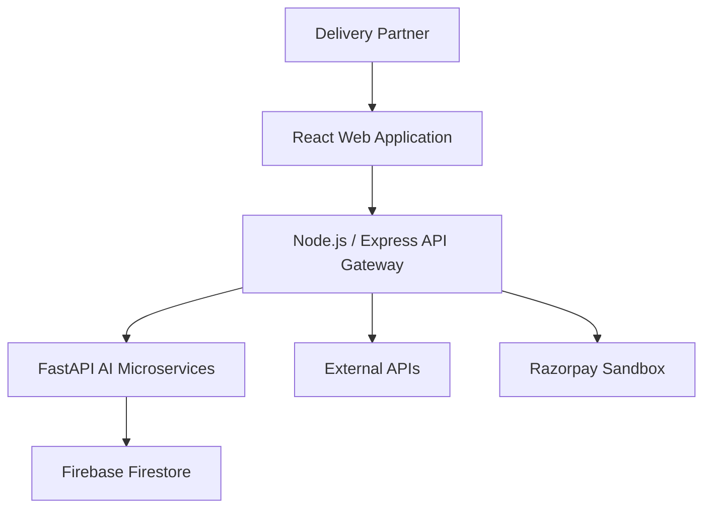

# SAFRA — AI-Powered Income Protection for Gig Workers

## Project Overview

Safra is an AI-powered parametric insurance platform designed to protect the income of quick-commerce delivery partners working for platforms such as Zepto, Blinkit, and Instamart.

Delivery riders in the gig economy rely on continuous deliveries to earn their daily income. However, external disruptions such as extreme weather, severe air pollution, and platform downtime can instantly stop deliveries, causing workers to lose a significant portion of their earnings. Currently, gig workers have little to no financial protection against these uncontrollable events.

Safra addresses this challenge by providing automated weekly micro-insurance for income loss. Riders enroll in the platform and receive dynamically priced insurance coverage based on the operational risk of their delivery zone. The system continuously monitors real-time environmental conditions and platform activity using external data sources such as weather APIs, air quality indices, and delivery activity signals.

When predefined disruption conditions occur—such as heavy rainfall, extreme heat, severe pollution, delivery activity collapse, or platform downtime—Safra automatically triggers a parametric claim. Compensation is calculated based on the duration of the disruption and is credited to the worker without requiring manual claim submissions.

By combining AI-driven risk assessment, dynamic premium pricing, automated disruption detection, and fraud monitoring, Safra provides a scalable safety net for gig economy workers and helps stabilize their income in unpredictable urban environments.

## Target Persona

Safra is designed for quick-commerce delivery partners working on platforms such as Zepto, Blinkit, and Instamart. These riders operate in dense urban areas and complete multiple short-distance deliveries throughout the day.

A typical delivery partner works between 8–10 hours daily, completing 2–4 deliveries per hour within a small service radius of approximately 2–3 km. Their earnings depend directly on the number of deliveries completed, making their income highly sensitive to interruptions in delivery operations.

External disruptions such as heavy rainfall, extreme heat, severe air pollution, or platform downtime can significantly reduce delivery demand or temporarily halt operations altogether. During such periods, riders lose valuable working hours and experience immediate income loss.

Despite these risks, gig delivery workers typically do not have access to insurance products that protect short-term income loss caused by environmental or operational disruptions.

Safra specifically addresses this gap by providing automated micro-insurance coverage for gig delivery workers, ensuring that riders receive financial compensation when external disruptions prevent them from working.

## Solution Overview

Safra is an AI-powered parametric micro-insurance platform designed to protect gig delivery workers from income loss caused by external disruptions. The platform provides delivery partners with a simple weekly insurance plan that automatically compensates them when events beyond their control prevent them from working.

Delivery partners can register on the platform and enroll in a weekly insurance plan. Safra uses AI-driven risk assessment to determine a dynamic premium based on the operational risk of the rider’s delivery zone. This ensures that workers operating in higher-risk areas receive appropriate coverage while maintaining fair pricing.

Once a rider is enrolled, the system continuously monitors multiple external data signals such as weather conditions, air quality levels, and delivery activity patterns. Safra identifies disruption events using predefined parametric triggers, including heavy rainfall, extreme heat, severe air pollution, delivery activity collapse, and platform downtime.

When a disruption is detected and persists beyond the defined threshold, the system automatically triggers a claim. The payout is calculated based on the duration of the disruption and credited to the worker without requiring manual claim submissions.

By combining automated disruption detection, dynamic risk-based pricing, and instant claim processing, Safra creates a scalable insurance model that provides gig workers with reliable financial protection during unpredictable operational disruptions.

## System Workflow

### 1. Worker Registration
Delivery partners sign up on the Safra platform and provide basic details such as their city, delivery platform (e.g., Zepto), and operational zone.

### 2. Risk Assessment
The system evaluates the operational risk of the worker’s delivery zone using historical environmental and activity data. An AI-based risk model generates a risk score that represents the likelihood of disruptions in that area.

### 3. Dynamic Premium Calculation
Based on the risk score, Safra calculates a weekly insurance premium. Workers operating in safer zones pay lower premiums, while those in higher-risk areas receive adjusted pricing and coverage.

### 4. Continuous Disruption Monitoring
After enrollment, Safra continuously monitors external signals using integrated data sources such as weather conditions, air quality levels, and delivery activity patterns.

### 5. Parametric Trigger Detection
When predefined conditions are met—such as prolonged heavy rainfall, extreme heat, severe air pollution, delivery activity collapse, or platform downtime—the system identifies a disruption event.

### 6. Disruption Detection & Claim Automation Pipeline



### 7. Instant Compensation
The calculated compensation is credited to the worker through the platform’s payout system.

## Parametric Trigger System

Safra uses a parametric insurance model where payouts are automatically triggered when predefined disruption conditions are detected.

Heavy Rainfall  
Rainfall intensity greater than 50 mm/hour for at least 2 consecutive hours.

Extreme Heat  
Temperature greater than 42°C for at least 2 consecutive hours.

Severe Air Pollution  
AQI greater than 350 for at least 2 consecutive hours.

Delivery Activity Collapse  
Average orders per hour drop by 70% or more for 2 hours.

Platform Downtime  
Delivery activity equals zero for 1 hour.

## Insurance Model

Safra follows a weekly micro-insurance model tailored to gig delivery workers.

Weekly Premium

Low Risk Zones: ₹20/week  
Moderate Risk Zones: ₹30/week  
High Risk Zones: ₹45/week  

Coverage Amount

Workers receive compensation of ₹400 per disruption day.

Duration-Based Compensation

Daily coverage: ₹400  
Estimated working hours: 10  
Hourly compensation: ₹40

Weekly Payout Limit

Maximum payout per worker per week: ₹2000

Adaptive Weekly Coverage Plans

| Plan     | Premium | Coverage |
| ------------| ---------- | -------- |
| Basic      | ₹20      | ₹200/day |
| Standard   | ₹35      | ₹400/day |
| Premium    | ₹50      | ₹700/day |

## Innovation Features

Trigger – Order Collapse Trigger  
Use delivery activity signals.  
Example: average_orders_per_hour drops by 70% for 2 hours.  
Meaning: Workers cannot earn, directly reflecting income loss.  
Notifying riders if there is high demand in nearby zones.  
Managing over-supply and under-supply of drivers based on delivery zones.  

Predictive Risk Alerts for Workers  
AI predicts disruptions before they occur.  
Example: High rain probability in next 2 hours → notification: “High disruption risk expected in your zone in the next 2 hours.”  
Workers can plan breaks, switch zones, or adjust schedules.  

Premium is calculated per zone, not per city.  

Adaptive Weekly Coverage Plans

| Plan     | Premium | Coverage |
| ------------| ---------- | -------- |
| Basic      | ₹20      | ₹200/day |
| Standard   | ₹35      | ₹400/day |
| Premium    | ₹50      | ₹700/day |

Real-Time Risk Map Dashboard  
Red zones → high disruption probability  
Yellow → moderate  
Green → normal  
Purple → oversupplied zones  

Oversupply Imbalance Protector  
AI predicts oversupply 1–2 hours ahead using delivery signals + historical rider density.  
Push notification: “Your zone is oversupplied — expected 40% fewer orders. Switch to Zone X (2 km away) for +35% demand.”  
Migration Boost: +₹75–150 extra on any claim that day + 10% premium discount next week.  

Transparent Earnings Impact Report + Personal Weekly Planner  
Auto-generated “My Income Shield Report” every Sunday showing breakdown of losses due to disruptions and suggested next week plan.  
Following the plan → auto-apply 15% premium discount next week.  

Rider Network Early-Warning System (Crowd-Powered GWDI)  
Workers can tap “Low orders here” → AI validates report → boosts GWDI for zone.  
Participants get Network Bonus: 5–10% lower weekly premium forever.  
Blue dots on risk map show live peer reports.  

Pre-Disruption Income Buffer Advance  
If GWDI prediction > 0.7 in next 2–4 hours → auto-offer ₹150–300 advance.  
Zero interest, instant Razorpay credit. Repayment automatically from next Safra payout or earnings.

## AI Components

Risk Prediction Model  
Predicts disruption probability based on environmental and operational data.

Dynamic Premium Model  
Calculates zone-level premiums dynamically based on disruption risk.

Fraud Detection Model  
Detects abnormal claim patterns to prevent system misuse.

All AI services run as Python FastAPI microservices.

## Technology Stack

Frontend  
React

Backend API Gateway  
Node.js with Express

AI Microservices  
Python FastAPI

Database  
Firebase Firestore

External Data Sources  
Weather APIs  
Air Quality APIs  
Delivery Activity Signals

Payments  
Razorpay Sandbox

## System Architecture



## Future Scope

Safra can expand to support multiple gig sectors such as ride-hailing drivers, logistics couriers, and on-demand service workers. Future improvements may include real platform integrations, improved predictive models, and real-time digital wallet payouts.

## Development Roadmap

```mermaid
timeline
title Safra Development Roadmap

Week 1 : Problem Research
        : Persona Definition
        : Architecture Design
        : Tech Stack Finalization

Week 2 : Frontend Setup
        : Backend API Gateway Setup
        : Firebase Integration
        : Worker Registration Interface

Week 3 : AI Model Development
        : Risk Prediction Model
        : Dynamic Premium Model
        : Fraud Detection Model

Week 4 : Trigger Engine Implementation
        : Weather API Integration
        : AQI API Integration
        : Delivery Activity Monitoring

Week 5 : Claim Automation System
        : Claim Processor
        : Payout Logic
        : Razorpay Integration

Week 6 : System Testing
        : Integration Testing
        : Performance Optimization
        : Final Demo Preparation
