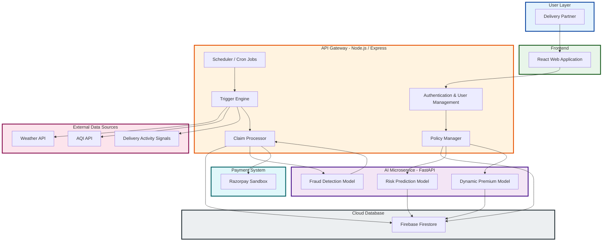
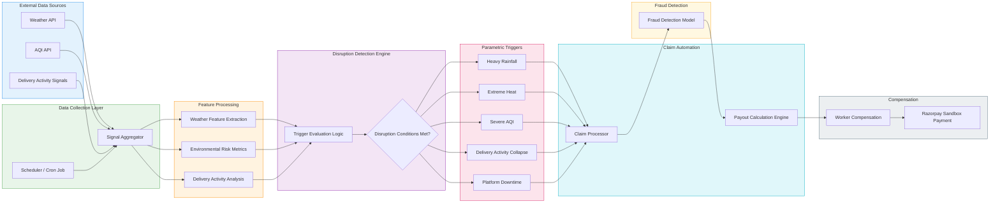

## System Architecture

> **Figure:** High-level architecture of Safra showing the interaction between the React client, Node.js API gateway, FastAPI AI services, Firebase data layer, and external disruption signals used for parametric insurance triggers.

## Disruption Detection & Claim Automation Pipeline

